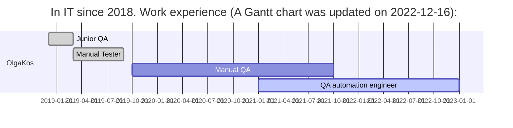
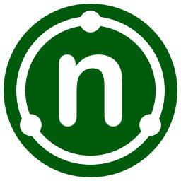
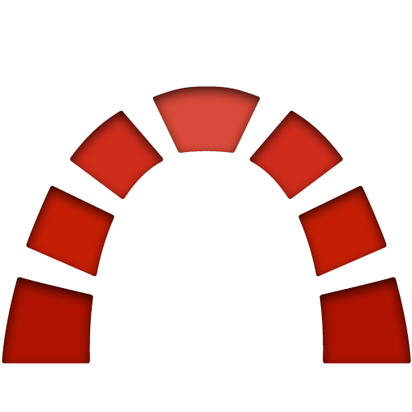

<h1 align="center">Hi there, I'm <a href="https://github.com/olgakos" target="_blank">Olga</a> :vulcan_salute: </h1>

- QA engineer from Saint-Petersburg 
- Python (30%), Java (50%), C# (20%)
- Коммерческий опыт в тестировании c 2019 года

    
<i>Details...</i>

<!-- Additional Work Line section -->
<!-- 
My Work Line
 -->  
    

<!-- EDU section -->
<!--
## :four_leaf_clover: Образование, курсы

<i>List</i>
 
    
* qa.guru
* software-testing.ru
* Udemy    

-->  

## :four_leaf_clover: Languages and Tools:
<code></code>
<code></code>
<code></code>
<code></code>
<code></code>
<code></code>
<code></code>
<code></code>
<code></code>
<code></code>
<code></code>
<code></code>
<code></code>
<code></code>

<code></code>
<code></code>
<code></code>
<code></code>
<code></code>
<code></code>
<code></code>
<code></code>
<code></code> 
<code></code> 
<code></code>
      
<!--
<code></code> 
<code></code> 

  

-->

 <!--   
<table valign="top"><tr>   
<td>
<b>Тестовые фреймворки:</b>
 - Selenide (Java) (80%) 
 - Selenium WebDriver (C#) (20%)
</td>   
<td  valign="top">
<b>Средства визуализации результатов тестирования: </b>
 - Allure 
 - Telegram Bot
</td>    
<td> 
<b>Version Control: </b>
 - Git + GitHub (80%) 
 - Mercurial (20%)
</td>
</tr><tr>
<td>
<b>Библиотеки для тестирования:</b>
 - JUnit5 (Java)
 - NUnit 2.4.6 (C#) 
 - Rest-Assured
</td>
       
<td>
<b>Системы багтрекинга:</b>
 - Redmine (90%)
 - Jira (10%)
</td>    
<td>
<b>Удаленный запуск</b>
 - Jenkins 
 - BrowserStack
</td>
</tr><tr>
<td>
<b>Сборщики проектов:</b>
 - Gradle (80%)
 - Maven (20%)
</td>  
<td>
<b>Databases:</b>
 - Microsoft SQL Server
 
</td>    
<td>
<b>Дополнительно:</b>
 - Postman
</td>
</tr></table>
-->

## :unicorn: Pet Projects:
Примеры моих демо-проектов с автоматизацией тестсиирования: 
#### Python:
<a target="_blank" href="https://github.com/olgakos/demo_woneit">Demo Wone IT company</a> (Python. UI tests, REST-API tests. Allure, Jenkins, Telegram Bot) 
<code></code>
<code></code> 
 <a target="_blank" href="https://github.com/olgakos/demo_alfabank_api2">Demo Alfa Bank API</a> (Python. REST-API tests.) 
<code></code>
<code></code>
 <a target="_blank" href="https://github.com/olgakos/demo_browserstack2">Wikipedia App (demo) (Python. Browsersteck.)</a>
<code></code>
<code></code>
<!--
 <a target="_blank" href="https://github.com/olgakos/demo_nytimes_app">Demo New York Times App (Python. Appium.)</a>
<code></code>
<code></code>-->

#### Java:
* <a target="_blank" href="https://github.com/olgakos/qa_guru_11_13_Demo_Itigris">Demo to Itigris</a>  (Java. UI tests, REST-API tests. Allure, Jenkins, Telegram Bot)
* <a target="_blank" href="https://github.com/olgakos/demo_Dune_API">Demo Dune API</a> (Java.  REST-API tests. Allure, Jenkins)
* <a target="_blank" href="https://github.com/olgakos/demo_rest_assured_tests">Demo Reqres.in API</a> (Java.  REST-API tests. Allure, Jenkins)
* <a target="_blank" href="https://github.com/olgakos/qa_guru_11_21_browserstack4">Demo тестирования мобильного приложения "Wikipedia"</a> (BrowserStack, Allure)

## :sunflower: Commercial Project: 
* Logistics Enterprise software (C#: Selenium WebDriver + NUnut. Java: Junit5 + REST-API)
 
<!--  Contacts section -->
## :anchor: Contacts   

  
 
    
<!--

-->
    
<!--

 

## :anchor: Contacts
  
  
--> 

<!--  Widgets section -->
 
<!--

-->

UPD 2022-12-20
