<h1 align="center">Hi there, I'm <a href="https://github.com/olgakos" target="_blank">Olga</a> :vulcan_salute: </h1>

- QA engineer from Saint-Petersburg
- Коммерческий опыт в тестировании c 2018 года

## :four_leaf_clover: What am I doing
- Пишу автотесты на Java (80%) и C# (20%)
- Выполняю ручное тестирование, взаимодействую с разработчиками
- Составляю документацию: тест-кейсы и чек-листы, пользовательские инструкции, поддерживаю актуальность корпоративной Wiki.
    
## :four_leaf_clover: Languages
- Java (50%) IntelliJIDEA
- Python (30%) PyCharm
- C# (20%) Visual Studio

## :four_leaf_clover: Тexнoлoгичeский стeк 

Я использую следующий стек и инструменты. Но открыта и к другим технологиям.

    

    
  
    

    
<!--   -->
<!--  -->  

  
    

     

    
<!--   -->
<!--  -->    

  

          
    
<!--

  

-->

    
<table valign="top"><tr>   
<td>
<b>Тестовые фреймворки:</b>
 - Selenide (Java) (80%) 
 - Selenium WebDriver (C#) (20%)
</td>   
<td  valign="top">
<b>Средства визуализации результатов тестирования: </b>
 - Allure 
 - Telegram Bot
</td>    
<td> 
<b>Version Control: </b>
 - Git + GitHub (80%) 
 - Mercurial (20%)
</td>
</tr><tr>
<td>
<b>Библиотеки для тестирования:</b>
 - JUnit5 (Java)
 - NUnit 2.4.6 (C#) 
 - Rest-Assured
</td>
       
<td>
<b>Системы багтрекинга:</b>
 - Redmine (90%)
 - Jira (10%)
</td>    
<td>
<b>Удаленный запуск</b>
 - Jenkins 
 - BrowserStack
</td>
</tr><tr>
<td>
<b>Сборщики проектов:</b>
 - Gradle (80%)
 - Maven (20%)
</td>  
<td>
<b>Databases:</b>
 - Microsoft SQL Server
 
</td>    
<td>
<b>Дополнительно:</b>
 - Postman
</td>
</tr></table>

## :sunflower: Commercial Projects 
* Logistics Enterprise software (C# 100%, Selenium WebDriver + NUnut. Java,  REST-API tests)

## :unicorn: Pet-projects
* <a target="_blank" href="https://github.com/olgakos/qa_guru_11_13_Demo_Itigris">Demo to Itigris</a>  (Java. UI tests, REST-API tests. Allure, Jenkins, Telegram Bot)
* <a target="_blank" href="https://github.com/olgakos/demo_woneit">Demo Wone IT company</a> (Python. UI tests, REST-API tests. Allure, Jenkins, Telegram Bot) 
* <a target="_blank" href="https://github.com/olgakos/demo_Dune_API">Demo Dune API</a> (Java.  REST-API tests. Allure, Jenkins)
* <a target="_blank" href="https://github.com/olgakos/demo_alfabank_api2">Demo Alfa Bank API</a> (Python. REST-API tests.)
* <a target="_blank" href="https://github.com/olgakos/qa_guru_11_21_browserstack4">Demo тестирования мобильного приложения "Wikipedia"</a> (BrowserStack, Allure)

## :four_leaf_clover: Образование, курсы    
* qa.guru
* software-testing.ru
* Udemy

 
 
## :anchor: Contacts   

 (...)
      

    
<!--

 

## :anchor: Contacts
  
  
-->
--------------------
UPD 2022-05-24
--------------------
    
      demo

<!-- Additional info section -->

	
  
Work Line

  

```mermaid
  gantt 
    title 𝟪+ 𝓎𝑒𝒶𝓇𝓈 𝒾𝓃 𝐼𝒯. 𝒲𝑜𝓇𝓀 𝑒𝓍𝓅𝑒𝓇𝒾𝑒𝓃𝒸𝑒:
    dateFormat  YYYY-MM
    section 👨‍💻
    Junior QA         :done, 2018-12, 90d
    Manual Tester	  :done, 2019-02, 180d
    Manual Tester     :done, 2019-10, 1095d
    Automtion QA      :done, 2021-01, 730d
```

-------------------

Образование в IT

## :four_leaf_clover: Образование, курсы    
* qa.guru
* software-testing.ru
* Udemy

